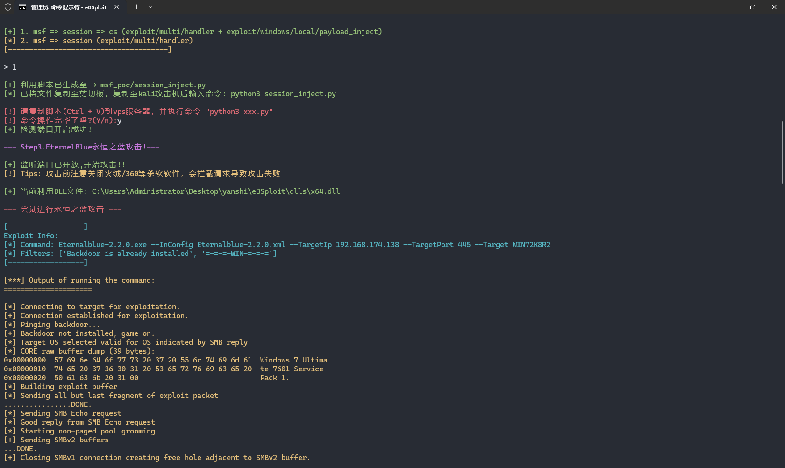

# eBSploit永恒之蓝windows快速利用工具


Github项目： https://github.com/Anyyy111/eBSploit

声明：本工具仅供以安全为目的的学习交流使用，任何人不得将其用于非法用途以及盈利等目的，否则后果自行承担。

## 介绍

作者: Anyyy

博客: https://www.anyiblog.top	

本文地址： https://www.anyiblog.top/2024/08/18/20240818

B站演示视频：https://www.bilibili.com/video/BV1PTpfeXEgc/?spm_id_from=333.999.0.0

eBSploit适用于内网渗透中遇到MS17-010漏洞的情况快速上线公网msf及cs，同时支持自定义dll命令执行、会话迁移等操作。

当前处于测试阶段，任何问题欢迎向我发送邮件：anyiguys@qq.com 或向我提交issue。

工具目前仅支持Windows系统。

## 特点


- 无需使用msfconsole，懒人操作一键打穿
- 菜单式选项操作，易上手
- 可自定义dll命令执行
- 支持上线msf以及上线cs (msf迁移会话)
- 通过生成dll版本的shellcode，利用攻击可在复杂的内网情况简单上线你的攻击服务器


## 快速开始


### 安装

Release中下载压缩包解压，命令行输入 eBSploit.exe 开始使用

**环境要求：**

1.需安装ruby 安装地址: https://github.com/oneclick/rubyinstaller2/releases/tag/RubyInstaller-3.0.4-1

ps: (程序由python编写，并用pyinstaller打包 无需安装其他第三方库 可快速使用)

**以上操作完成后均需要添加至环境变量**


### 配置

配置文件位于项目目录下的 `config.yaml` 文件

```yaml
dll_file:
  path: 
exploit_host:
  arch: 
  ip: 
  port: 
local_host:
  ip: 
  port: 
vps:
  ip: 
  port: 
```

---

#### 字段

**（带*号的为必填参数）**

##### exploit_host

**arch** 攻击目标的系统版本位数 可选: [x86, x64, x32] 默认(x64)

***ip** 攻击目标的IP地址

**port** 攻击目标的端口 默认(445)


##### local_host

***ip** msf攻击服务器的监听IP地址 

***port** msf攻击服务器的监听端口


##### vps （可选）

**vps_ip** cs服务器的监听IP地址 

**vps_port** cs服务器的监听端口


##### dll_file 

***dll_file** dll文件的路径，该文件必须为shellcode代码，是永恒之蓝攻击加载的必要参数。

-------------------

#### 修改

##### 直接编辑config.yaml


##### 程序自带的修改功能（推荐）

**可以使用软件的编辑功能来修改字段内容：**

运行程序，选择功能5：


此时可以直接编辑字段：


通过小键盘的方向键选择字段，回车编辑字段，再输入内容即可修改。


`输入 t 切换字段  输入 s 保存内容  输入 q 退出`


PS: 程序会自动复制字段的已有内容，直接ctrl+v可以直接粘贴内容


### 使用

#### 操作原理

使用工具前先了解操作原理，会更容易理解功能如何使用。


1. 通过生成一个shellcode的dll文件，通过EternalBlue永恒之蓝种植后门后DoublePulsar双脉冲星调用（功能点1和4）


2. 如果是反弹msf的情况就需要kali服务器使用msfconsole的`exploit/multi/handler`模块来监听，用于接收反弹shell（功能点2）

   如果是反弹msf再反弹cs的情况，本质上是通过msf监听得到的shell利用模块`exploit/windows/local/payload_inject`进行迁移，这里需要cs服务器配置监听器（详细操作参考2.1.1中的配置截图）

   **脚本会自动生成一份监听脚本，上传至服务器后python运行可自动监听和检测是否上线。**

   

   如果是自定义命令执行的情况则无需监听，直接跳转至 第三步进行攻击


3. 以上准备工作做完以后，就可以开始攻击了（功能点3），运行完成后检测msfconsole是否反弹shell成功，以及cs是否迁移会话成功即可。


#### 1. Shellcode生成

这里的shellcode统一生成为dll文件，用于双脉充星DoublePulsar调用。

dll文件保存于 `dlls`文件夹


##### 1.1 上线msf的shellcode生成

功能点1：

(这里要用到msfvenom来生成，使用前需检查ruby是否安装成功)


生成成功后，系统会自动指定dll_file字段为新生成dll的路径，同时会询问是否跳转至监听脚本生成，这个视情况选择。


##### 1.2 任意命令shellcode生成

功能点4：


生成成功后，系统会自动指定dll_file字段为新生成dll的路径


#### 2. msf监听脚本生成

MS17-010反弹shell往往是反弹到msf的监听模块中，这里程序会根据你的参数设置自动生成一份msf监听调用脚本。


##### 2.1 反弹Msfconsole再迁移至cs会话脚本

功能点2：


使用前我们需要配置cs服务器

###### 2.1.1 CS监听器配置

打开监听器：


添加监听器：


添加hosts:


修改端口 添加名称 保存：


监听器payload是这样的就说明配置成功了


**（这里的IP和端口就是配置文件vps字段需要填写的部分）**


配置完成后选择功能点1

（未配置好参数系统会自动跳转）


配置完毕后会生成msf的脚本（系统会自动复制脚本，直接cv粘贴到kali）：


然后复制到kali攻击服务器后python3运行即可进行监听。


##### 2.2 反弹Msfconsole脚本

功能点2：


选择功能点2

（未配置好参数系统会自动跳转）


配置完毕后会生成msf的脚本（系统会自动复制脚本，直接cv粘贴到kali）：


然后复制到kali攻击服务器后python3运行即可进行监听。


#### 3. EternalBlue攻击

反弹shellcode的dll生成后以及服务器开始监听后，就可以开始攻击了。

原理是先用EternalBlue种植后门，再用Doublepulsar利用后门调用恶意dll，实现代码执行。

**如果这台机子此前被永恒之蓝攻击过，且没有关机重启，可能会导致攻击失败。**

功能点3:


运行完后会在根目录生成payload.txt用于手工复现：


切换到目录 `exploit_eternalpulse/` 打开cmd输入命令即可重测。


#### 4. 一键Getshell!

结合了前面几个功能点，当参数配置完成后直接开始一把梭！





### 需要Socks5代理的情况


这里用proxifier代理应用，需要注意代理时需要代理所有的exe程序，因为调用了其他的exe。

例如 `C:\Users\Administrator\Desktop\yanshi\eBSploit\*.exe` ：


